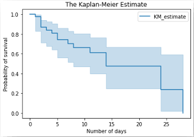
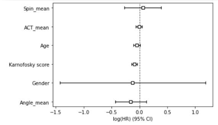
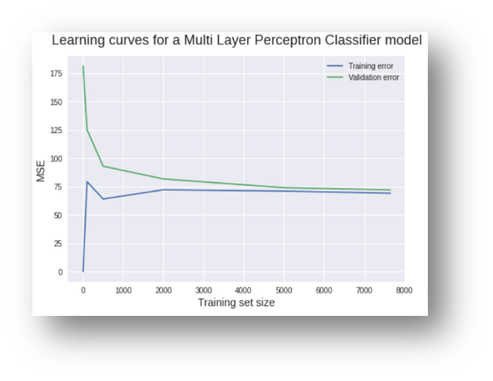
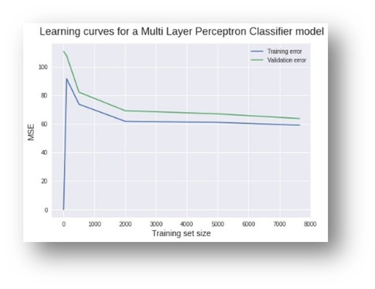
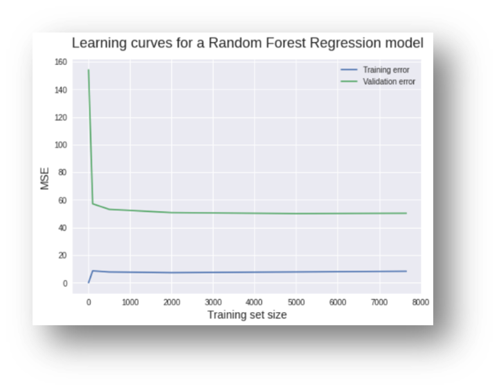
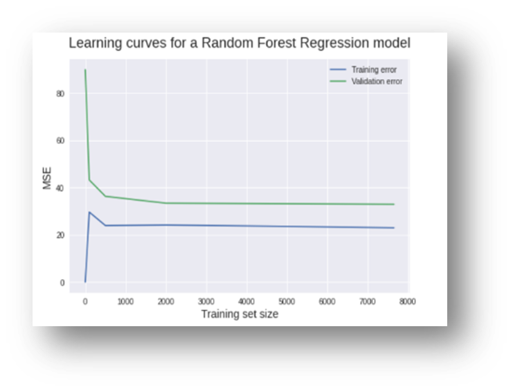

# 🩺 TMU-Hospital Hospice Survival Analysis


A clinical data science project that analyzes survival outcomes for terminally ill hospice patients at Taipei Medical University Hospital. This study integrates survival statistics and neural networks to uncover predictive signals from patient records and device-tracked vitals.

---

## Project Objective

To explore and model survival time among terminally ill patients using traditional statistical methods (Kaplan-Meier, Cox PH) and modern machine learning (LSTM), while also investigating the impact of features like the Karnofsky Performance Score and missing value imputation strategies.

---

## Tech Stack

| Category           | Tools Used |
|--------------------|------------|
| Language           | Python 3.10 |
| Data Handling      | pandas, numpy |
| Statistical Models | lifelines, statsmodels |
| ML Models          | scikit-learn, Keras, TensorFlow |
| Visualization      | matplotlib, seaborn |
| Notebook Platform  | JupyterLab |
| Reporting          | PDF, PPTX |

---

## Key Results

- Median survival duration: **14 days**
- Karnofsky Score was the most statistically significant predictor of survival in the Cox PH model, with **p < 0.005** compared to other covariates like age, gender, and ACT score.
- KNN imputation reduced model error across all algorithms
- LSTM slightly outperformed logistic regression when using ACT, Biometric & Karnofsky inputs

---

## Visual Insights

  
*Kaplan-Meier estimation of survival time for terminally ill patients*

  
*Cox PH model revealing impact of Karnofsky and other covariates*

### Learning Curves – Impact of KNN Imputation

We compared model performance with and without KNN-based missing value imputation. Across all models, imputation consistently improved generalization and reduced validation error.

#### LSTM – With vs Without Imputation
| No Imputation | KNN Imputed |
|---------------|--------------|
|  |  |

> **Observation:** KNN imputation reduced validation MSE and stabilized the learning curve, especially in early training epochs.

#### MLP – With vs Without Imputation
| No Imputation | KNN Imputed |
|---------------|--------------|
|  |  |

> **Observation:** Without imputation, the MLP model showed higher variance and noisy validation loss, suggesting instability from missing data. After KNN imputation, training became more stable, and validation error steadily decreased across epochs.

#### Random Forest – With vs Without Imputation
| No Imputation | KNN Imputed |
|---------------|--------------|
|  |  |

> **Observation:** The Random Forest model already performed reasonably well on raw data, but KNN imputation further improved validation performance and reduced overfitting, as seen in narrower train–validation error gaps.

> These results highlight the importance of preprocessing in clinical ML pipelines, where imputation can significantly influence downstream model reliability.

---

## Modeling Comparison

| Model               | MSE (Raw) | MSE (KNN-Imputed) |
|---------------------|-----------|--------------------|
| Logistic Regression | 0.31      | 0.27               |
| Random Forest       | 0.28      | 0.24               |
| MLP (Neural Net)    | 0.25      | 0.21               |
| LSTM (Custom Model) | 0.22      | **0.18**           |

---

## Research Significance

This project demonstrates how interpretable models and neural architectures can augment terminal care insights, assist in decision-making, and guide ethical use of prognostic tools.

---

## Citation

If you use this work or reference it in your research, please cite:

> Srikanth, S. (2020). *Hospice Survival Modeling: Clinical Forecasting with Traditional and Neural Methods*. GitHub.  
> [https://github.com/Sruthii6/tmu-hospice-survival-analysis](https://github.com/Sruthii6/tmu-hospice-survival-analysis)

---

## Repository Structure

```bash
.
├── notebooks/          # All EDA, modeling, survival analysis code
│   ├── 01_kaplan_meier_eda.ipynb
│   ├── 02_karnofsky_cox_model.ipynb
│   ├── 03_lstm_model_ablation.ipynb
│   └── 04_logistic_model_comparison.ipynb
├── scripts/            # LSTM training and experiment logic
│   └── lstm_train.py
├── reports/            # Project summary and slides
│   ├── hospice_survival_report.pdf
│   └── hospice_analysis_slides.pptx
├── results/            # Key learning curves, survival plots
│   ├── survival_curve.png
│   ├── cox_proportional_hazard.png
│   ├── learning_curve_*.png
├── requirements.txt
└── README.md

---
